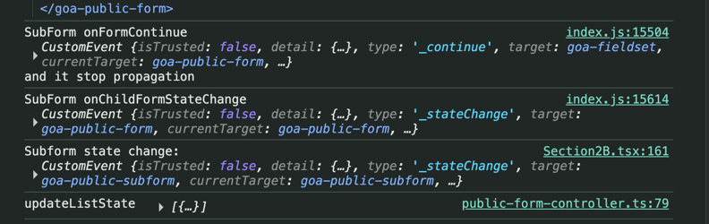

I have the example React page on Section2B.tsx.

Goal:
I want to complete the `GoabPublicFormPage` without having to use the `GoabPublicFormPage type="summary"`. After I fill in Dependent Full name, I click Continue, it should go back to `GoabPublicSubformIndex`.

What I have investigated so far:

1. If we use the `GoabPublicFormPage type="summary"`, the page will go back to `GoabPublicSubformIndex` directly. The flow is: when I click Continue (line 288), it will
receive a console message continueToSubform at SubFormIndex.svelte, stop propagation but will go to onChildFormStateChange, and then update the state of the form (trigger both onSubformStateChange Section2B.tsx at line 242 and `onMainFormStateChange` at Section2B.tsx at line 202.

2. If we don't use the `GoabPublicFormPage type="summary"` and I use `childFormController.complete` this is what I debug:

The ref of the form is pointed to SubForm.svelte `goa-public-form` with `data-id=subform-form`, even I trigger complete, looks like `onChildFormComplete` isn't called and therefore, I stop at the Dependant page, I cannot go back to sub form index. 

Investigate for me. 
